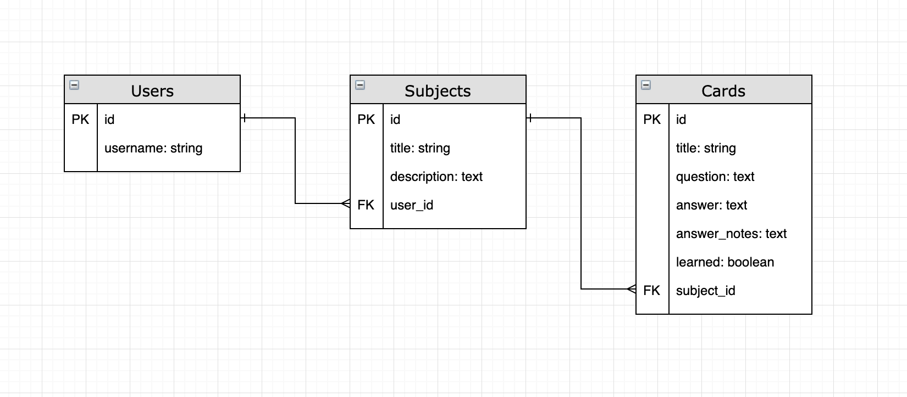
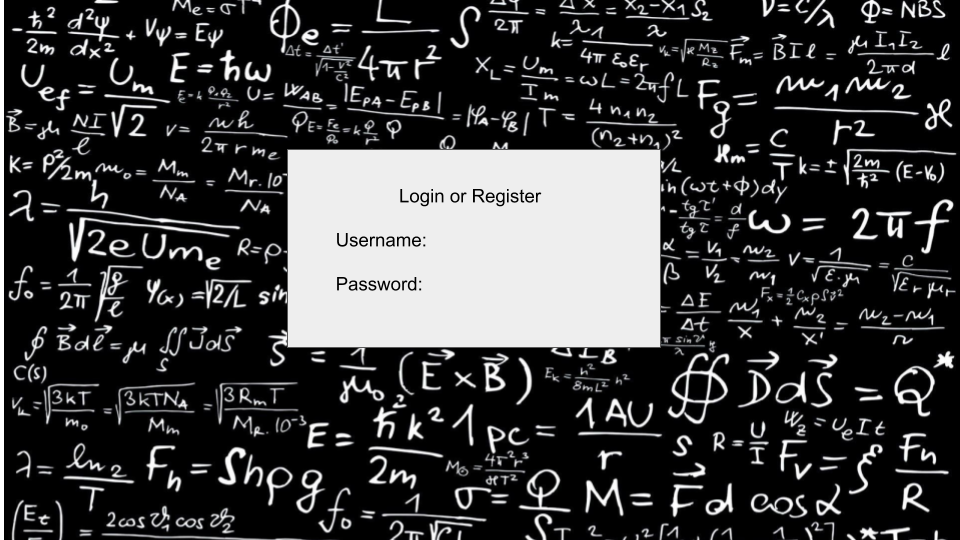
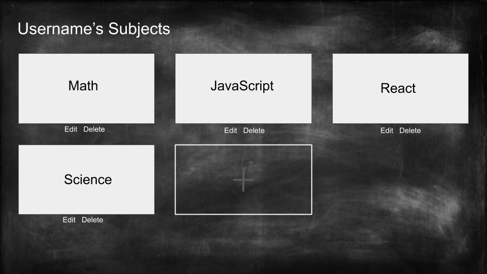
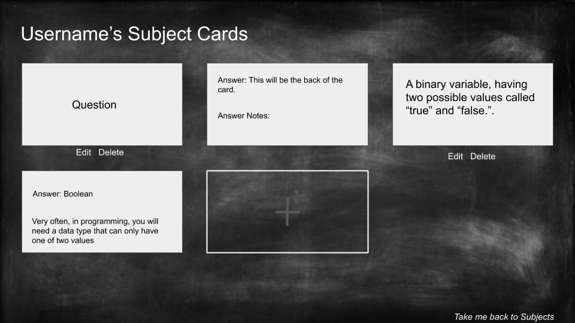
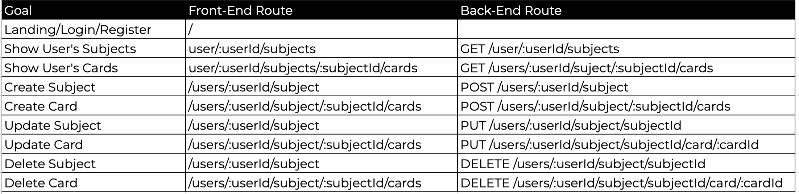

# Flash Cards


## Product Description
A web app where a learner can create, read, update and delete flash cards. 

I expect a challanging 4 days of coding the majority of this project as it needs to include a backend with a custom database and user authorization. 

### MVP and Post MVP
MVP will include:

* User authorization
* Full CRUD usability with JSON API backend
* Basic CSS

Post MVP will include: 

* Upscale CSS
* Users can mark cards as learned

Stretch Goal:

* Count down of cards to be learned

## Installation Instructions

* rails bundles
  * CORS
  * Awesome Print
  * Pry Rails
  * bye bug
* React 
  * npm install
  * npm react-router-dom 
  * npm i axios	

## Features List
* Users can view all their subjects decks on one page
* Users can view all their cards by subjects on one page

## Entity Relationship Diagram (ERD)




## Wireframes
Landing Page


Subject Page


Card Page



## React Component Heirachy 
```
<Header />
<main>
	<Login />
	<Subject Index />
		<Create Subject>
	    <Update Subject>
	    <Delete Subject>
	<Subject Show Page>
		<Create Card>
		<Update Card>
		<Delete Card>
<Footer />

```

## API Endpoints




## Dependencies

* No Dependencies

## Technologies Used

* Ruby on Rails
* React
* JSON RESTful API

## Additional Libraries

* TBD

## Timeframe

| Component | Priority | Estimated Time | Time Invetsted | Actual Time |
| --- | :---: |  :---: | :---: | :---: |
| MVP| H | 2 days| TBD | TBD |
| Post MVP | H | 1.5 Days| TBD  | TBD |
| Stretch Goal | H | .5 Days| TBD  | TBD |
| QA | H | .25 Days| TBD  | TBD |
| Deployment | H | .25 Days| TBD  | TBD |
| Total | H | 4.5 Days| TBD | TBD |

## Helper Fucntions TBD

* TBD Function Name and Description
* Code Snippit I'm proud of
* Issues and Resolutions
* Updated Timeframe table


